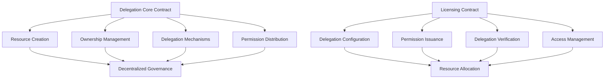

# Delegate Daemon

A decentralized framework for flexible, secure, and granular resource delegation on the Stacks blockchain.

## Overview

Delegate Daemon enables token holders to:
- Create dynamic resource allocation strategies
- Establish flexible delegation models
- Define multi-tiered permission structures
- Manage and track resource usage rights
- Implement complex delegation workflows

Participants can:
- Create and configure delegation permissions
- Track and verify resource allocations
- Manage revocable and time-bound delegations
- Build sophisticated governance and access control systems

## Architecture

The platform consists of two main smart contracts that handle core delegation and licensing functionality:



## Contract Documentation

### Delegation Core (`delegation-core.clar`)

The core contract manages fundamental delegation mechanisms:

- Resource creation and tracking
- Ownership and transfer protocols
- Delegation configuration
- Permission management

Key features:
- Flexible delegation models
- Configurable allocation strategies
- Dynamic resource tracking
- Secure transfer mechanisms

### Licensing (`delegation-license.clar`)

Handles complex delegation and licensing permissions:

- Multi-tier delegation configurations
- Configurable access rights
- Verification and revocation systems
- Granular permission management

## Getting Started

### Prerequisites
- Clarinet
- Stacks wallet
- STX tokens for transactions
- Basic understanding of delegation models

### Basic Usage

1. Creating a delegatable resource:
```clarity
(contract-call? .delegation-core create-resource "resource-uri" u100)
```

2. Configuring delegation permissions:
```clarity
(contract-call? .delegation-core set-delegation-parameters resource-id principal-list permission-level)
```

3. Configuring a licensing tier:
```clarity
(contract-call? .delegation-license configure-delegation-tier resource-id token-id tier price duration-days max-delegations)
```

## Function Reference

### Core Delegation Functions

#### Resource Management
```clarity
(create-resource (resource-uri (string-utf8 256)) (delegation-percentage uint))
(update-resource-metadata (resource-id uint) (new-resource-uri (string-utf8 256)))
(freeze-resource-metadata (resource-id uint))
```

#### Delegation Mechanisms
```clarity
(set-delegation (resource-id uint) (delegatee principal) (delegation-level uint))
(transfer-delegation (resource-id uint) (new-delegatee principal))
(revoke-delegation (resource-id uint) (delegatee principal))
```

### Licensing Functions

#### Delegation Licensing
```clarity
(configure-delegation-tier (resource-id uint) (token-id uint) (tier uint) (price uint) (duration-days uint) (max-delegations (optional uint)))
(acquire-delegation (resource-id uint) (token-id uint) (tier uint))
(renew-delegation (resource-id uint) (token-id uint) (tier uint))
(cancel-delegation (resource-id uint) (token-id uint) (tier uint) (delegatee principal))
```

## Development

### Testing
Run tests using Clarinet:
```bash
clarinet test
```

### Local Development
1. Start local chain:
```bash
clarinet integrate
```

2. Deploy contracts:
```bash
clarinet deploy
```

## Security Considerations

### Core Contract
- Royalty calculations use basis points to avoid floating-point issues
- Ownership checks prevent unauthorized transfers
- Metadata freezing prevents post-sale modifications

### Licensing Contract
- License validation prevents unauthorized usage
- Expiration tracking ensures proper access control
- Creator-only license configuration and revocation
- Maximum license count enforcement

### General
- All financial transactions verify sufficient funds
- Access control checks on privileged operations
- State changes are atomic and consistent